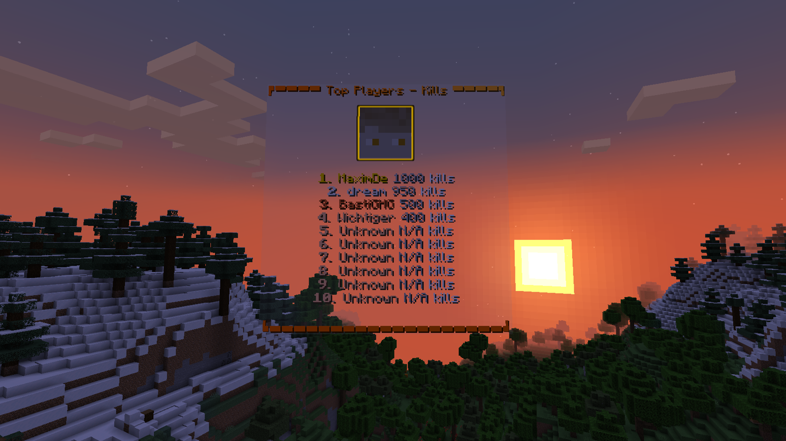

</div>
<div align="center">
<p><b>FOLIA ✅ PAPER ✅ PURPUR ✅ 1.19.4 - 1.21 ✅</b></p>
<a href="https://discord.gg/2UTkYj26B4" target="_blank"></a>
<a href="https://github.com/max1mde/ExampleHologramPlugin"></a>
<a href="https://jitpack.io/#max1mde/HologramLib"></a> 
<a href="https://github.com/max1mde/HologramLib/releases"></a>
<br>

<p>Leave a :star: if you like this library :octocat:</p>
</div>

<div>
<h3>Contents</h3>
• <a href="#installation">Installation</a><br>
• <a href="#exampleshowcase-plugin">Example plugin with which uses HologramLib</a>
<br>
<br>
<details>
<summary><a href="#first-steps">First Steps</a></summary>
&nbsp;&nbsp;&nbsp;• <a href="#initializing-hologrammanager">Initializing Manager</a><br>
&nbsp;&nbsp;&nbsp;• <a href="#hologram-rendering-modes">Rendering Modes</a><br>
&nbsp;&nbsp;&nbsp;• <a href="#hologram-creation">Creation</a><br>
&nbsp;&nbsp;&nbsp;• <a href="#hologram-animation">Text Animations</a><br>
&nbsp;&nbsp;&nbsp;• <a href="#leaderboard-creation">Leaderboards</a><br>
&nbsp;&nbsp;&nbsp;• <a href="#setting-a-hologram-as-a-passenger">Passengers</a><br>
&nbsp;&nbsp;&nbsp;• <a href="#managing-hologram-viewers">Viewers</a><br>
&nbsp;&nbsp;&nbsp;• <a href="#advanced-transformations">Transformations</a><br>
&nbsp;&nbsp;&nbsp;• <a href="#hologram-retrieval-and-management">Management</a>
</details>
</div>

# Features
- Text, Block & Item Holograms
- Text animations
- Minimessage support
- Packet based
- Per player holograms
- Leaderboard generators
- Advanced hologram customization
- Attachment and parenting support
- Flexible rendering modes

# Installation

- Download packet events https://www.spigotmc.org/resources/80279/
- Download HologramLib-[version]**.jar** file from the [latest release](https://github.com/max1mde/HologramLib/releases)
- Upload the HologramLib-[version]**.jar** and packet events file on your server (_yourserver/**plugins**_ folder)
- Add the plugin as a dependency to your plugin and use it

> [!NOTE]  
> You might also want to add [packetevents](https://github.com/retrooper/packetevents/wiki/Depending-on-pre%E2%80%90built-PacketEvents) as a compile-only dependency to your plugin  
> if you want to use (import) certain features, such as the `ItemStack` for the item hologram.

**Gradle installation**
```groovy
repositories {
  maven { url 'https://jitpack.io' }
}

dependencies {
  compileOnly 'com.github.max1mde:HologramLib:1.6.2.1'
}
```
**Maven installation**
```xml
<repository>
  <id>jitpack.io</id>
  <url>https://jitpack.io</url>
</repository>

<dependency>
  <groupId>com.github.max1mde</groupId>
  <artifactId>HologramLib</artifactId>
  <version>1.6.2.1</version>
  <scope>provided</scope>
</dependency>
```
Add this to your plugin
`plugin.yml`
```yml
depend:
  - HologramLib
```

# Example/Showcase Plugin
https://github.com/max1mde/ExampleHologramPlugin

# First Steps

### Initializing HologramManager
```java
private HologramManager hologramManager;

@Override
public void onEnable() {
    hologramManager = HologramLib.getManager().orElse(null);
    if (hologramManager == null) {
        getLogger().severe("Failed to initialize HologramLib manager.");
        return;
    }
}
```

> [!IMPORTANT]
> If you are shading the library use `HologramLib.getManager(<Your plugin instance>)` instead!

### Hologram Rendering Modes
```java
// Different rendering modes available
TextHologram hologram = new TextHologram("example", RenderMode.NEARBY);
// Modes include:
// - NEARBY: Render for players near the hologram
// - ALL: Render for all online players
// - VIEWER_LIST: Render only for manually added viewers
// - NONE: Do not render
```

> [!NOTE]  
> `Display.Billboard.CENTER` = the hologram rotates to the player like a nametag (default value)  
> `Display.Billboard.FIXED` = The holograms rotation is fixed  
> `Display.Billboard.VERTICAL` = The hologram only rotates to the left and right (is horizontally fixed)  
> `Display.Billboard.HORIZONTAL` = The hologram only rotates up and down (is vertically fixed)  

### Hologram Creation

#### Text Hologram
```java
TextHologram hologram = new TextHologram("unique_id")
    .setMiniMessageText("<aqua>Hello world!")
    .setSeeThroughBlocks(false)
    .setBillboard(Display.Billboard.VERTICAL)
    .setShadow(true)
    .setScale(1.5F, 1.5F, 1.5F)
    .setTextOpacity((byte) 200)
    .setBackgroundColor(Color.fromARGB(60, 255, 236, 222).asARGB())
    .setAlignment(TextDisplay.TextAlignment.CENTER)
    .setViewRange(1.0)
    .setMaxLineWidth(200);
```
#### Block Hologram
````java
BlockHologram blockHologram = new BlockHologram("unique_id")
    .setBlock(1) 
    .setOnFire(false)
    .setBillboard(Display.Billboard.VERTICAL)
    .setScale(1.0F, 1.0F, 1.0F)
    .setViewRange(1.0);
````

#### Item Hologram
````java
ItemHologram itemHologram = new ItemHologram("unique_id")
    .setItem(new ItemStack.Builder()
        .type(ItemTypes.DIAMOND_SWORD)
        .build())
    .setGlowing(true)
    .setGlowColor(Color.ORANGE)
    .setOnFire(false)
    .setDisplayType(ItemDisplayMeta.DisplayType.FIXED)
    .setBillboard(Display.Billboard.VERTICAL)
    .setScale(2.0F, 2.0F, 0.01F)
    .setViewRange(1.0);
````

#### Spawning any hologram (including leaderboard objects)
````java
hologramManager.spawn(hologram, location);
````

### Hologram Animation
#### 1. **Creating a Basic Text Animation**

To get started with text animations, you first need to create a `TextAnimation` object and add frames (text lines) to it. Each frame represents a state of the hologram's text that will be displayed during the animation cycle.

```java
/*
*Creating a basic text animation with a 20-tick delay and 20-tick speed
*/
TextAnimation textAnimation = new TextAnimation()
    .setDelay(20) // Delay before starting the animation (20 ticks = 1 second)
    .setSpeed(20) // Speed at which the animation updates (20 ticks = 1 second)

textAnimation.addFrame("Hello World!")
    .addFrame("Welcome to HologramLib")
    .addFrame("Enjoy the animations!");

/*
* Applying the animation to a hologram
* which also automatically starts playing the animation
*/
hologramManager.applyAnimation(someHologram, textAnimation);
```

In the example above, the `TextAnimation` object is created with a delay and speed setting. Then, we add multiple text frames, which will be shown in sequence.

---

#### 2. **Typing Animation**

To simulate a typing effect, we can slowly reveal text frame by frame. Here’s how to set up a typing animation:

```java
TextAnimation typingAnimation = new TextAnimation()
    .setDelay(5)
    .setSpeed(5);

typingAnimation.addFrame("T")
    .addFrame("Ty")
    .addFrame("Typ")
    .addFrame("Type")
    .addFrame("Typing");

hologramManager.applyAnimation(someHologram, typingAnimation);
```

---

#### 3. **Color Changing Animation**

You can also animate the color of the hologram text. Here’s an example of a color-changing animation using `MiniMessage` formatting.

```java
TextAnimation colorChangeAnimation = new TextAnimation()
    .setDelay(20)
    .setSpeed(20);

colorChangeAnimation.addFrame("<red>Red Text</red>")
    .addFrame("<green>Green Text</green>")
    .addFrame("<blue>Blue Text</blue>");

hologramManager.applyAnimation(someHologram, colorChangeAnimation);
```

In this case, each frame will change the color of the text using the `MiniMessage` syntax. You can replace the `<color>` tags with any color code supported by MiniMessage.

---

#### 4. **Modifying animations**

There are a few more methods in the TextAnimation class which you can use.

```java
TextAnimation animation = new TextAnimation()...;

animation.clearFrames();
animation.addFrame(<text>);
animation.removeFrame(<index>);
animation.removeLastFrame();
animation.removeFirstFrame();
```

### Leaderboard Creation



```java
Map<Integer, String> leaderboardData = new LinkedHashMap<>() {{
    put(1, "MaximDe:1000");
    put(2, "dream:950");
    put(3, "BastiGHG:500");
    put(4, "Wichtiger:400");
    // ... more entries
}};

LeaderboardHologram leaderboard = hologramManager.generateLeaderboard(
        location,
        leaderboardData,
        LeaderboardHologram.LeaderboardOptions.builder()
                .title("Top Players - Kills")
                .showEmptyPlaces(true)
                .scale(1.2f)
                .maxDisplayEntries(10)
                .suffix("kills")
                .topPlayerHead(true)
                .build()
);

/*
 Update the leaderboard later if needed
 */
hologramManager.updateLeaderboard(
        leaderboard,
        updatedData,
        /*
         ou can also use different options here 
         which will be applied to the leaderboard
         */
        leaderboard.getOptions()
);
```

### Setting a hologram as a passenger
```java
hologramManager.attach(hologram, parentEntityId);
```

### Managing Hologram Viewers
This only makes sense if you set the holograms `RenderMode` to `VIEWER_LIST`
```java
hologram.addViewer(player);
hologram.removeViewer(player);
hologram.removeAllViewers();

// The players who see the hologram
List<Player> currentViewers = hologram.getViewers();
```

### Advanced Transformations
```java
hologram.setTranslation(0, 1, 0) 
    .setLeftRotation(0, 1, 0, 0) 
    .setRightRotation(0, 1, 0, 0)
    .update();  // Apply changes (make them visible to the player)
```

### Hologram Retrieval and Management
```java
Optional<TextHologram> retrievedHologram = hologramManager.getHologram("unique_id");

hologramManager.remove("unique_id");

hologramManager.remove(hologram/leaderboard);

hologramManager.removeAll();
```

Contributions to this repo or the example plugin are welcome!
